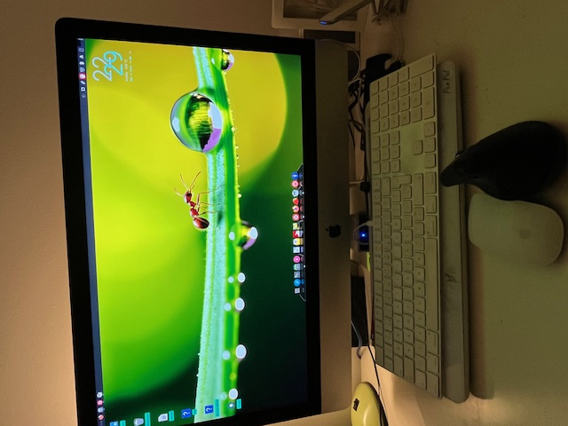
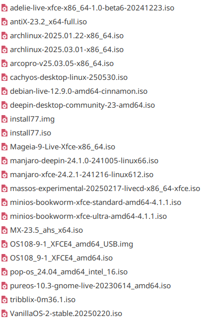

### Imac 18,3 Intel reaches EOL: what's next?

###       1. The Concept

The intel powered mac computers are now reaching their End Of Life according to Apple: no more updates, less security updates. Software is intentionally being withdrawn since apps will stop working.

The hardware so, that is a different story. My iMac 18,3 made in 2017 is still working perfectly and it has a display that is one of the best I have seen.

So, the project aim is to continue to use the hardware for as long as possible or until the device stops working.

The iMac is an all-in-one device: the motherboard and power supply unit are installed behind the screen in a thin casing of aluminium. To access the components the screen needs to be taken off completely and re-assembled.
And that is a very difficult and dangerous job…

So, I decided that I could install a linux distro and double boot it with macOS: I tried and failed miserably because of the mac fusion drive setup… and it was slow.

The next best thing is to use an external SSD but connected to the thunderbolt port of the imac.
After researching a lot on the internet I bought a 	ZikeDrive Z666 USB4 40Gbps NVMe M.2 SSD Enclosure with a Samsung 990 EVO NVMe M.2 SSD 1 TB, PCIe 4.0 x4 / PCIe 5.0 x2, NVMe 2.0 (2280) SSD. That should give good speeds.

###    2. The Journey towards a Solution

 First task was to find a distro that worked almost out-of-the-box. To make testing easier I used a Ventoy USB dongle with a lot of live ISOs.
 
 

From this list I chose MXlinux because it fulfilled most requirements and worked as soon as installed.
The biggest challenge was how to boot the thunderbolt disk in MXlinux.
The situation is that the thunderbolt port driver is not loaded until he kernel boots.
This means that the initrdfs (initial ram disk) needs to load the thunderbolt driver and then boot the kernel.

I found the answer in this forum 
[https://forums.linuxmint.com/viewtopic.php?t=439989](https://forums.linuxmint.com/viewtopic.php?t=439989) 

Quoting from that post it tells how to do it and I am really grateful to xiongyw for his solution. Italics are added by me.

- add thunderbolt in
- 
  `` /etc/initramfs-tools/module ``

*Then create a script and make it executable*
- `` sudo chmod +x /etc/initramfs-tools/scripts/init-premount/thunderbolt-auth.sh``
 
with the following content to manually authorize the links:

       #!/bin/sh

       PREREQ=""`

        prereqs() { echo "$PREREQ"; }`

       case $1 in `

        prereqs) prereqs; exit 0;;

        esac

        . /scripts/functions

      log_begin_msg "Authorizing Thunderbolt devices"

        for device in /sys/bus/thunderbolt/devices/*; do
            if [ -f "$device/authorized" ]; 
        then

               echo 1 > "$device/authorized"

                log_success_msg "Authorized`` $device"
            fi
        done
        log_end_msg   >

then update initramfs 

     sudo update-initramfs -u  

To get this to work I installed the MX system by connecting the enclosure to an USB3.0 port and booting it from there and then applied the xiongyw code.
It worked perfectly!

After this I had a working MXlinux system and I was able to modify all the "appearance" settings to my liking and preference (desktop,wallpaper,office suite,Etc.)

As it is well known, wifi does not work but the latest kernels have the driver/module ready. 
Next was audio which I got to work using this module:
[https://github.com/davidjo/snd_hda_macbookpro](https://github.com/davidjo/snd_hda_macbookpro)

The mounting of the iMac APFS files was achieved by installing [https://github.com/linux-apfs/linux-apfs-rw](https://github.com/linux-apfs/linux-apfs-rw)
With that I can access all my old documents and files on the iMac fusion drive. To make module addition permanent it is neessary to add apfs to the end of file /etc/modules and copy the apfs.ko module to a new folder called apfs in /usr/lib/modules/$(uname -r)/kernel/drivers/

The last issue is bluetooth to connect the Magic Mouse and the keyboard. I could not find a solution and just plugged the keyboard into the usb port and used a wifi dongle mouse.

The iMac CPU does the work, the display makes it a pleasure to work on the iMac and the Thunderbolt drive gives me the speed. Finally MXlinux has all the apps I need and it will be updated and kept safe (I hope!)

I hope this helps somebody else to keep "old" Intel Apple macs running.
